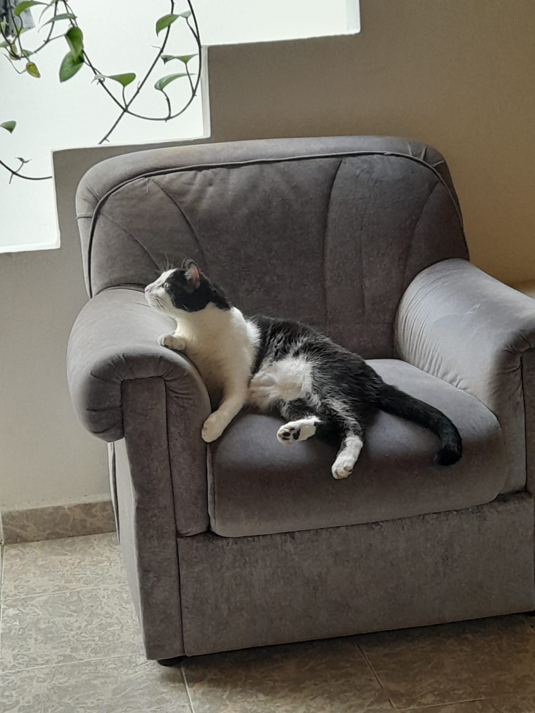

<h1>👋 Hi nice to meet you, I'm Johan Esteban Restrepo Ramirez 💻</h1>

<table>
  <tr>
  <td width="200">
  
  </td>
  <td>
  

    I'm from Medellín, Colombia ☔ I have great skills in <strong>Java, Spring boot, SQL and AWS</strong>, thanks to my efforts of self learning and find the answers that I looking for. 
  

  

    I really like to learn something new 🎃, create new things that fix some problem and be the best version of me every day 💪, if a learned or I avanced a little bit in the day I will be happy with my progress, for that reason I want to improve my skills in the programing area. My goal is be the best in Backend! 🚵.
  

  </td>
  </tr>
</table>

<h2>✍️ Current Focus</h2>
<ul>
  <li>🧠 Progress with my skills in Java, Spring Boot and the unit testing</li>
  <li>☁️ Learning and practicing in AWS, manage every important module and understand the best practices in the cloud.</li>
  <li>🙏 perfect my soft skills, that give me the tools to work with my partners and understand the requirements of my clients.</li>
  <li>🗣️ Improve my english skills, read more documentation and talk with others to get more vocabulary.</li>
  <li>🧑‍💻 Understand and participate more in the continuous integration, practice the best practices in the programing flow.</li>
  <li>🫀 I want to be the best partner and employee with the objective to be the most reliable, always give a hand with the others problems and projects.</li>
</ul>

<h2>🧠 Tech Stack</h2>

  <strong>Languages:</strong> Java, JavaScript, Python 
  <strong>Frameworks:</strong> Spring Boot 
  <strong>Tools:</strong> GitHub, Scrum, Kanbam 
  <strong>Cloud:</strong> AWS

<h2>🧗 My experience</h2>

<h3>ITIS 2023 - 2025 🛫</h3>
<strong>Functional consultant for Oracle tools</strong>
<li>Case resolution of Eloqua, Sales Cloud, PPM, HCM.</li>
<li>Requirements gathering.</li>
<li>Management of clients and report preparation.</li>
<li>Planning of projects and execution.</li>
<li>Practice in Python and AWS.</li>

<h3>RAPPI 🧭</h3>
<strong>Data Scientist Jr</strong>
<li>Launching experiments in the Split tool.</li>
<li>QA planning and execution.</li>
<li>Dashboard generation in Snowflake.</li>
<li>Data analisis and data presentation.</li>
<li>Generation of Queries.</li>
<li>Process documentation.</li>
<li>Python and SQL</li>

<h3>EAFIT🧬</h3>
<strong>CRM analyst</strong>
<li>Management and administration of CRM tools.</li>
<li>Resolution of doubts.</li>
<li>Training management.</li>
<li>Leadership of improvement projects.</li>
<li>Database maintenance.</li>
<li>Data análisis and data presentation.</li>
<li>Implementation of automatic processes.</li>
<li>Form editing (HTML, CSS y JavaScript).</li>
<li>Java y AWS.</li>

<h2>🤝 Connect with Me</h2>
<ul>
  <li>💼 <a href="https://www.linkedin.com/in/johan-esteban-restrepo-ramirez/" target="_blank">LinkedIn</a></li>
  <li>📫 esnic1994@gmail.com</li>
  <li>🐙 GitHub: <a href="https://github.com/JohanRestrepo/JohanERestrepoR" target="_blank">@JohanRestrepo</a></li>
</ul>

<blockquote>
  <em>"If you're failing you're learning, forward is that way."</em> 
  — Johan E Restrepo R
</blockquote>

Emojis: https://emojipedia.org/